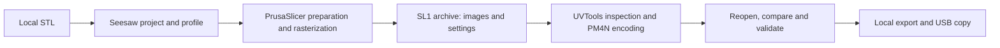

# ProgreTech Seesaw — technical specification

Optional generation: see [experimental image-to-3D integration](EXPERIMENTAL_GENERATION.md).

Current implementation: see [0.3 workspace capabilities and limits](WORKSPACE_0_3.md).
The original requirements/history below are not a claim that every planned feature is complete.

Version 0.1 • 2026-10-02 • Owner: Edwin / ProgreTech • Prepared by Codex

This is the initial engineering specification. “Must” describes release requirements,
not features already implemented. The initial implementation was a read-only desktop and Python core foundation.
Current implementation status is tracked in `ROADMAP.md` and `DESKTOP_WORKFLOW.md`.

## 1. Purpose and scope

Build a simple, open-source Ubuntu desktop application that takes a local model to
a usable printer file without accounts, recurring internet access or manual handoffs
between slicers. Python owns the UI, project state, profiles, orchestration and tests.
Existing native engines do the expensive work.

The first qualified printer is **Anycubic Photon Mono 4**, a resin/MSLA printer. It is
not the Mono 4K or Mono 4 Ultra. The first material is Anycubic clear water-washable
resin; the exact bottle variant and validated exposure settings remain open.

“Works with most printers” is the long-term compatibility goal, not an initial claim.
Printer support must be published as a tested capability matrix. Resin and FDM use
different pipelines, settings and acceptance tests. Vendor-locked formats may remain
unsupported where a dependable FOSS encoder is unavailable.

Baseline includes STL import, placement, scaling, resin preparation, layer preview,
local project save/reopen, validated PM4N export, dependency diagnostics and cancellation.
No cloud services, remote printing, accounts, telemetry or generated-model features
are required. OBJ/3MF import and additional printer families follow the Mono 4 path.

## 2. Backend decision

Use this reference path:



The intermediate is an SL1 layer archive. Exporting a supported STL throws away
exposure, layer and motion context, and UVTools' documented PrusaSlicer workflow uses
SL1. Supported STL export remains useful for interchange or the optional Rust path.
See [UVTools integration instructions](https://github.com/sn4k3/UVtools/wiki/Setup-PrusaSlicer).

| Component | Responsibility | Decision |
| --- | --- | --- |
| PrusaSlicer | Model transforms, SLA supports/hollowing and layer rasterization | Reference engine; begin with subprocess interface |
| UVTools | Sliced-file diagnostics, conversion and PM4N encoding/decoding | Reference encoder; v7.0.1 source contains Mono 4 handling |
| mslicer | Alternative Rust slicing and related geometry tools | Optional research adapter; qualify output and performance before adoption |
| Seesaw | Friendly UI, reproducible settings, workflow and validation | Python, with native libraries for rendering and geometry inspection |

Do not merge three codebases up front. Keep engines independently replaceable. Use
subprocesses where sufficient, and contribute a small upstream patch or helper only
when a required capability is not accessible. A command-line flag is not assumed to
exist merely because the upstream GUI has the feature.

PrusaSlicer automatic orientation, drain-hole editing and manual support-point editing
need a specific integration spike. If its CLI cannot express them, first test saved
SLA project interchange, then a narrow native helper over its existing algorithms.
Opening an external editor may be useful during development, but does not satisfy
the final seamless-workflow acceptance criterion. Do not recreate support algorithms
in Python to avoid that integration work.

Source review found Rust support-generation code in current mslicer even though its
README still recommends a proprietary support tool. The code and README do not prove
feature maturity. No proprietary tool becomes a Seesaw dependency. See
[backend review](BACKEND_REVIEW.md) for exact revisions and evidence.

## 3. Target platform and dependencies

Reference development interpreter: Python 3.12. Initial deployment targets: Ubuntu
24.04 LTS and 26.04 LTS, x86-64. The development workstation is Ubuntu 26.04.1; other
targets require their own packaged smoke tests. Wayland and X11 are separate test cases.

Use PySide6/Qt Widgets for desktop controls, PyVista/VTK for interactive geometry,
and trimesh/NumPy for lightweight mesh inspection. These are implementation choices
to qualify against startup, package size, memory and rendering behavior. Avoid an
embedded browser and a local HTTP server for the baseline.

CUDA is not a slicing dependency. A software-rendering fallback or a useful graphics
diagnostic is required if the OpenGL viewport cannot initialize. The current starter
requires a functioning Qt/VTK rendering stack.

Proposed development targets, not measured minimums: 4-core x86-64 CPU, 8 GB RAM,
16 GB preferred for 10K jobs, and at least 10 GB scratch space. Measure representative
jobs before publishing hardware minimums. A single 9024 × 5120 8-bit raster uses
46,202,880 bytes (~44.1 MiB); keeping thousands of uncompressed layers in Python is
not acceptable. Preview uses a bounded cache; geometry and raster work stay in native
workers. Backend memory use must be measured, because conversion can expand archives.

## 4. Python architecture

The following boundaries are planned; the starter implements only `model`, discovery,
command planning, CLI and read-only desktop import/inspection.

| Module boundary | Contract |
| --- | --- |
| Domain/project | Immutable settings snapshots, units, model transforms, printer and resin identifiers |
| Profiles | Versioned printer/resin schema, provenance, qualification status, migration |
| Mesh service | Import, inspection, displayed transforms, mesh hashes; never silently repair originals |
| Engine adapters | Capabilities, version probe, job arguments, progress, cancellation, artifacts |
| Job runner | Worker lifecycle, process groups, deadlines, logs, disk checks, failure handling |
| Validation | Archive checks, native-file readback, profile agreement, export gates |
| Desktop | State-driven controls, model viewport, layer preview and actionable errors |
| Storage | Atomic project save, per-job directories, cache and recovery |

Use typed Python records and explicit units. Adapters accept a job specification and
write results into a unique job directory; they do not mutate UI state or user models.
Pass subprocess argv arrays with `shell=False`; isolate backend configuration and
disable network/update/post-process behaviors. Commands from downloaded profiles
must never be executed. A future API should expose `probe()`, `prepare()`, `slice()`,
`convert()`, `inspect()` and `cancel()` with structured results.

Progress states: importing → checking → preparing → slicing → inspecting → encoding →
validating → ready. Every running state can fail or cancel. Parameter or model edits
invalidate all dependent previews and exports; completion of an old job cannot mark
a newer project ready. Job IDs and input hashes enforce that rule.

Failures must preserve enough local diagnostics to explain the stage and next action.
Handle missing tools, unsupported versions, malformed geometry, full disks, backend
crashes, timeouts, cancellation and disconnected USB drives. Terminate the complete
process group, then clean incomplete output. UI stays responsive and never reports
success merely because a subprocess exited with status zero.

## 5. Printer and resin profiles

Mono 4 source-derived candidate values:

| Field | Candidate value / policy |
| --- | --- |
| Technology | MSLA, resin |
| Native extension | `.pm4n` |
| Raster | 9024 × 5120 pixels |
| Active display | 153.408 × 87.040 mm per UVTools machine table |
| Maximum Z | 165 mm |
| XY pitch | 0.017 mm, derived from source display/raster values |
| Orientation | UVTools machine table declares horizontal flip; end-to-end mirroring must be tested |
| Qualification | Source-reviewed only; no physical print has passed |

Anycubic's marketed dimensions are rounded; do not substitute rounded display sizes
into pixel-pitch calculations without testing. [Manufacturer reference](https://wiki.anycubic.com/en/resin-3d-printer/photon-mono-4).
Preserve the distinction between display size, printable region and mechanical volume.

Printer profiles contain stable identity, family, firmware evidence, raster dimensions,
display dimensions, axis mapping, mirror behavior, bed coordinates, Z limit, output
format/version, backend compatibility, provenance and qualification status. Never
choose a similarly named printer as a silent fallback.

Resin profiles contain exact product/color, printer association, layer height, normal
and bottom exposure, bottom/transition layer count, rest times, lift/retract distances
and speeds, units, temperature range and calibration evidence. Store mm/s versus
mm/min explicitly and convert at the adapter boundary. Unknown settings remain
unknown; no invented “universal” exposure preset.

Quality presets should describe layer height and its tradeoffs. They must not imply
that clear resin uses the same exposure as opaque resin. For the user's water-washable
material, collect exact SKU/product generation and calibrate a small test before an
arbitrary Thingiverse model. The UI's cleanup help must follow the selected resin's
manufacturer instructions; water-washable must not be presented as safe for drain disposal.

All profiles are local. Profile updates are user-initiated imports with a preview of
changes. A locked profile version remains associated with each project and job.

## 6. User experience

Follow the supplied image's structure: warm light background, navy text, teal primary
action, wide central viewport, models/tools at left and print setup at right. Use the
name ProgreTech Seesaw. Avoid the filament spool, PLA, infill/extra-strength controls
and “plastic grams” from the reference for resin mode.

1. **Add model.** Drag/drop or browse STL. Show filename, dimensions, units assumption,
   mesh issues and build-volume fit. Never silently resize an oversized model.
2. **Prepare.** Choose printer and resin. Move/rotate/scale with undo, arrange copies,
   propose orientation, add supports, optionally hollow and place drain holes. Simple
   defaults first; expose real settings and units under Advanced. Hollowing stays off
   until drain/void handling is implemented and reviewable.
3. **Preview.** Show supported geometry and actual sliced layers with a slider, layer
   number, Z height, exposure and island/void findings. Distinguish repairable findings
   from blockers. Give resin/time estimates with their uncertainty; do not display
   invented estimates when engines have not supplied them.
4. **Export.** Encode PM4N, reopen it, validate it, then save locally or copy to a chosen
   mounted USB directory. Show printer, material, profile revision and validation state.
   No print command is sent to the machine. Keep a useful confirmation after export.

Status messages should say “Fits without supports” or “Geometry has open edges,” not
claim “No repairs needed” from a single watertightness test. A model that fits may
still fail once supports and raft are included. Require keyboard access, visible
focus, readable contrast and text alongside color indicators. Test at 1280 × 800
and 100–200% desktop scaling; smaller screens can collapse side panels.

The starter has a real orbitable STL viewport, dimensional inspection and an explicitly
disabled export action. It does not represent later steps as completed.

## 7. Project and job storage

Plan a `.seesaw` project container with a versioned manifest, source meshes, editable
transforms, settings, optional support/hollowing data and content hashes. Do not
serialize Python objects with pickle. Validate archive paths, entry counts, expanded
sizes and schemas before loading; reject path traversal and external resource URLs.

Save with a temporary file in the destination filesystem, flush, then atomic rename.
Never overwrite source meshes. Export similarly uses a temporary native file and
publishes it only after readback validation. USB copy verifies the resulting checksum
and reports I/O errors without claiming success. Automatic unmount is not required.

Use XDG paths for installed-app config/cache/state and user-selected project/export
locations. For this workstation's development work, source stays under PyCharm projects;
task artifacts and release deliverables must be on PT_CONTEXT as recorded in the project
instructions. User models and logs do not go into Git. Retention and cleanup must be
visible and must not delete unsaved work.

## 8. Encoding and export acceptance

Do not implement a Python PM4N encoder. Use the qualified UVTools encoder and retain
backend versions and input/output hashes in the job manifest.

Before export, compare SL1 and decoded PM4N for: raster dimensions, layer count,
layer height/Z sequence, pixel orientation, exposure and bottom/transition behavior,
lift/retract/rest parameters, machine identity and preview validity. Compare layer
pixels or documented tolerances if antialiasing/quantization changes representation.
An asymmetric orientation fixture with readable markers must catch mirrored/rotated
prints; a symmetric cube cannot validate axis mapping.

Validate file boundaries, nonempty layers where expected, finite/in-range settings,
Z/build-volume limits and supported format version. Do not rename an arbitrary file
to `.pm4n`, infer compatibility from extension alone or accept conversion as proof
of firmware support. UVTools readback is valuable but shares encoder assumptions;
hardware qualification is the final independent check.

Research command shape (not yet executed or accepted as a tested integration):

```text
prusa-slicer --load trusted-complete-sla.ini --export-sla --output layers.sl1 model.stl
UVtoolsCmd convert layers.sl1 pm4n candidate.pm4n --no-overwrite
UVtoolsCmd print-properties candidate.pm4n
UVtoolsCmd print-issues candidate.pm4n
```

PrusaSlicer release 2.9.6 is the initial binary candidate. Reviewed development source
also exposes SLA export. UVTools v7.0.1 is the encoder candidate. Pin executables,
hashes and native dependencies only after running the compatibility tests; reviewed
Git commits are recorded separately from tested binary versions.

## 9. Offline and packaging requirements

After installation, every baseline path must work with networking disabled, including
first launch, slicing, help and restart. No CDN assets, licensing server, account,
automatic updates, telemetry or hidden package download. Upstream defaults must be
audited, not assumed offline because source code is available.

Use a developer virtual environment first. Qualify an Ubuntu package or self-contained
bundle later, including native backend runtimes and Qt/VTK libraries. Compare Flatpak
and native packaging against filesystem access, subprocess control, updates and
air-gapped install behavior before selecting the release format. An offline installer
needs a complete wheel/native dependency set, checksums, notices and corresponding
source/build instructions. It must not run `pip` against the internet on first launch.

Seesaw code is AGPL-3.0-only. Keep upstream components independently attributable;
include their license texts, modifications and build/source access in distributions.
Do a dependency-license inventory before shipping bundles. Do not claim that merely
using subprocesses removes distribution obligations. No proprietary support service,
CUDA weights or external model license is required for the baseline.

## 10. Tests and release gates

| Level | Required evidence |
| --- | --- |
| Unit | Profile validation/units, state invalidation, fit calculations, settings translation, cancellation and export gating |
| Geometry fixtures | Closed/open/degenerate/oversized meshes, off-center geometry, asymmetric markers, supports/hollowing/drain-hole cases |
| Backend integration | Actual pinned binaries create SL1 and PM4N; valid readback and expected layer/parameter agreement |
| Failure integration | Missing/incompatible tools, corrupt input, timeout, full disk, cancellation, backend crash and partial output cleanup |
| Desktop | End-to-end workflow, responsive worker progress, save/reopen/undo, scaling, X11/Wayland and rendering failures |
| Offline | Fresh installed app and complete job under disabled networking, with observed no outbound dependency |
| Performance | Wall time, peak RSS, disk use, layer-preview latency and cancellation latency on a recorded fixture set |
| Hardware | Firmware recognizes output, orientation/exposure calibration succeeds, dimensions/adhesion and representative model print pass |

Suggested UX budgets to measure: progress visible within 500 ms of a long operation,
cached layer changes under 100 ms, cancellation acknowledged within 1 s and backend
termination within 5 s. These are acceptance targets, not measured starter results.

The Mono 4 is used for **hardware acceptance**, not unit tests. Unit tests run without
a printer. A hardware receipt records firmware, resin variant, temperature, settings,
artifact checksum, photographs/measurements and outcome. Edwin performs physical
printer work; software cannot declare that print successful without that evidence.

“Ready for Edwin to test” requires the integrated UI to create and reopen a PM4N from
a local STL, preserve the settings and layer checks, pass an offline run, and provide
a calibration-first test guide. Full Mono 4 qualification follows the real print.

## 11. Later local AI phase

Start only after the offline baseline passes its gates. Add an optional Python
orchestration layer for local image-to-3D and, where supported, text-conditioned
generation. User supplies model weights and selects installed runtimes. Ship no
weights and do not auto-download them.

Each provider manifest declares model identifier/license, expected file hashes,
Python/runtime version, supported CUDA/driver/GPU requirements, tested VRAM/RAM/disk
minimums, recommended capacity, input constraints and output format. There is no
universal minimum VRAM number across models. Query local GPU/driver/memory and compare
against the selected provider; show missing capability and a realistic alternative.
Do not silently offload to cloud or switch models.

Run inference in an isolated worker environment with progress, cancellation and OOM
handling. Avoid executing arbitrary downloaded model code. Store locally generated
assets and provenance in the project, respecting model/output license terms. Generated
meshes reenter the same scale, topology, hollowing/support and preview checks; successful
inference never means printable geometry. CPU-only slicing remains available whether
or not AI dependencies are installed.

## 12. Open questions and next decisions

- Exact Anycubic resin product variant and tested settings; firmware version of the printer.
- PrusaSlicer headless access to orientation, holes and editable support data.
- Complete Mono 4 SLA profile translation and precisely where mirroring is applied.
- Tested UVTools parameter mapping, memory use and codec version for this firmware.
- Packaging choice after native/Flatpak process and offline-install trials.
- mslicer benchmark and correctness results; no performance claim accepted from README alone.

None prevents creating this project. Each is a bounded milestone before its dependent
feature can be marked complete.
